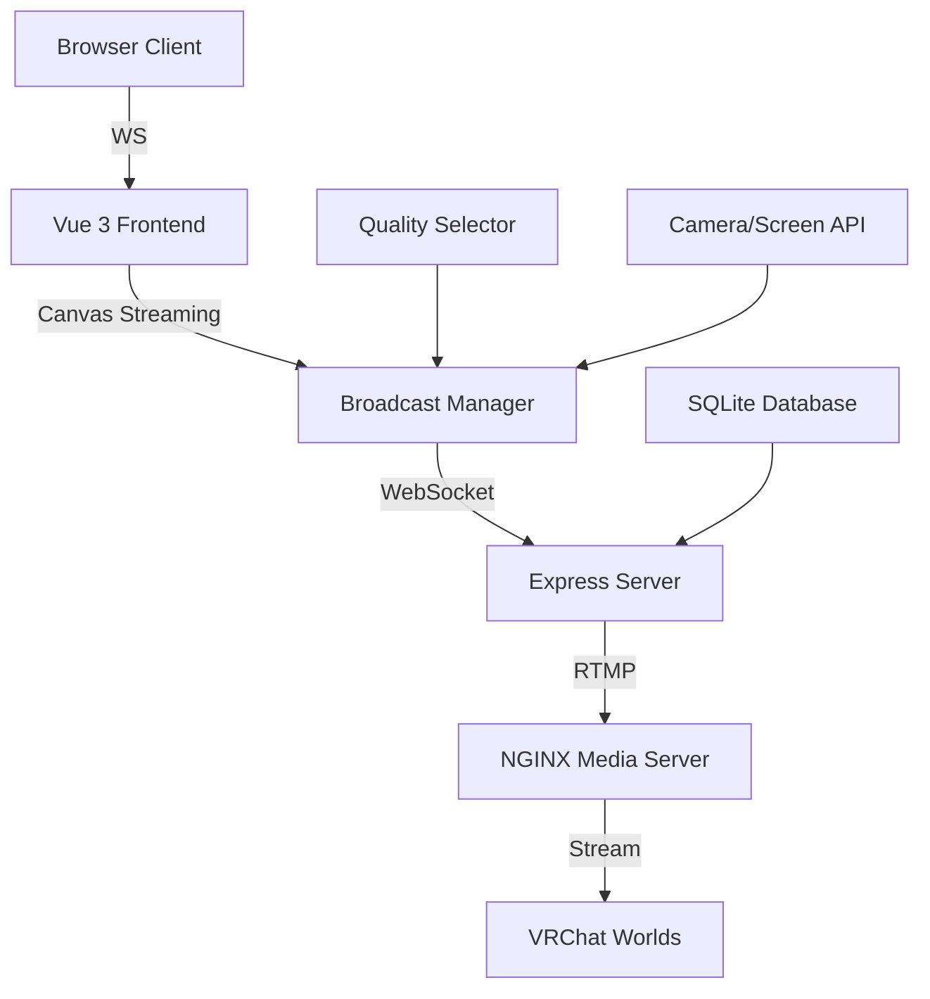

# 🎮 VrBroadcast by Nyades

<div align="center">


**Next-generation VR streaming and broadcasting platform**

[](https://cast.nyades.dev)
[](#)
[](#)
[](#)
[](#)

</div>

---

## ✨ Features

🚀 **Real-time Streaming**
- Screen & camera capture
- Low-latency RTMP streaming
- Adaptive quality control (480p - 1440p)
- H.264 hardware acceleration

🎯 **VRChat Integration** 
- Direct streaming to VRChat worlds
- Optimized for virtual reality environments
- Real-time viewer count tracking

🛠 **Developer Experience**
- Modern Vue 3 + TypeScript stack
- Hot module replacement for development
- Built-in NGINX RTMP server
- Cross-platform compatibility

🌍 **Internationalization**
- Multi-language support (EN, RU, ZH)
- Responsive design for all devices
- Modern gradient UI with animations

## 🚀 Quick Start

### Prerequisites

- **Node.js** 18+ with experimental features support
- **Modern browser** (Chrome/Edge recommended, Firefox has known issues)
- **HTTPS** required for camera/screen access

### Installation

```bash
# Clone the repository
git clone https://github.com/nyades/vrbroadcast.git
cd vrbroadcast

# Install dependencies
npm install

# Start development server
npm run dev
```

### Production Build

```bash
# Build for production
npm run build

# Start production server
npm start
```

## 🏗️ Architecture



### Core Components

- **🎨 Frontend**: Vue 3 + TypeScript with modern gradient UI
- **⚡ Backend**: Express.js with WebSocket support
- **📹 Streaming**: Canvas → WS → RTMP pipeline
- **🗄️ Database**: SQLite with key-value store
- **🌐 Media Server**: NGINX with RTMP module

## 📱 Usage

1. **Select Mode**: Choose between screen sharing or camera broadcast
2. **Quality Settings**: Pick resolution from 480p to 1440p
3. **Start Stream**: Click the gradient button to begin
4. **Copy RTMP Link**: Share the generated link in VRChat
5. **Monitor Stats**: View real-time quality and viewer metrics

### Browser Compatibility

| Browser | Screen Share | Camera | RTMP | Status |
|---------|--------------|--------|------|--------|
| Chrome  | ✅ | ✅ | ✅ | Recommended |
| Edge    | ✅ | ✅ | ✅ | Recommended |
| Firefox | ⚠️ | ⚠️ | ⚠️ | Known Issues |

## 🔧 Configuration

### Environment Variables

```bash
# Server Configuration
PORT=3000
HTTPS_PORT=8443

# RTMP Settings
RTMP_PORT=1935
RTMP_URL=rtmp://localhost:1935/live

# Quality Presets
SMART_TRANSCODE=true
```


## 🛠️ Development

### Project Structure

```
src/
├── components/          # Vue components
│   ├── VRCast.vue      # Main streaming interface
│   ├── QualitySelector.vue
│   └── HeaderBar.vue
├── lib/                 # Core libraries
│   ├── broadcast-manager.ts  # streaming logic
│   ├── websocket-server.ts   # Real-time communication
│   └── transfer-handler.ts   # RTMP pipeline
├── assets/             # Static resources
└── i18n.ts            # Internationalization

rtmp-server/           # NGINX RTMP configuration
public/               # Static files
dist/                # Production build
```


## 🎨 UI Features

### Modern Design System

- **🌈 Gradient Backgrounds**: Purple to pink gradients throughout
- **⚡ Smooth Animations**: Hover effects and transitions
- **📱 Responsive Layout**: Mobile-first design approach
- **🔥 Glass Morphism**: Semi-transparent cards with blur effects

### Interactive Elements

- **Quality Selector**: Visual quality presets with live preview
- **Stream Toggle**: Animated start/stop with status indicators  
- **RTMP Copy**: One-click link copying with feedback
- **Stats Dashboard**: Real-time metrics display

## 🌐 Browser APIs Used

- **MediaDevices**: Camera and screen capture
- **Canvas API**: Video frame processing
- **WebSocket**: Real-time communication
- **Clipboard API**: RTMP link copying
- **Intersection Observer**: Performance optimization

## 🚧 Roadmap

### Current (Pre-Alpha)
- [x] Basic streaming
- [x] RTMP server integration
- [x] Quality selector
- [x] Multi-language support

### Upcoming Features
- [ ] **Stream Recording**: Local MP4 recording
- [ ] **Chat Integration**: Live chat overlay
- [ ] **Multi-Platform**: Twitch, YouTube streaming
- [ ] **Advanced Effects**: Filters and overlays
- [ ] **Team Collaboration**: Multi-user broadcasts
- [ ] **Analytics Dashboard**: Detailed streaming metrics

## 🤝 Contributing

We welcome contributions! Please see our [Contributing Guidelines](CONTRIBUTING.md) for details.

### Development Setup

1. Fork the repository
2. Create a feature branch: `git checkout -b feature/amazing-feature`
3. Commit changes: `git commit -m 'Add amazing feature'`
4. Push to branch: `git push origin feature/amazing-feature`
5. Open a Pull Request

## 📄 License

This project is licensed under the MIT License - see the [LICENSE](LICENSE) file for details.

## 🎯 Support

- **🌐 Website**: [nyades.dev](https://nyades.dev)
- **💬 Discord**: [Join our community](https://discord.gg/nyades)
- **📧 Email**: [contact@nyades.dev](mailto:contact@nyades.dev)
- **☕ Donate**: Support development on [Ko-fi](https://ko-fi.com/nyades)

---

<div align="center">

**Made with ❤️ by [Nyades](https://nyades.dev)**

*Bringing virtual reality streaming to everyone*

</div>